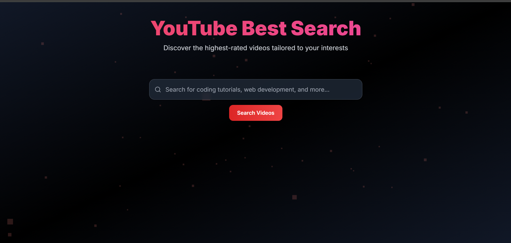
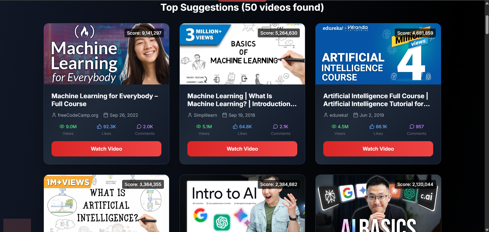

# 📺 YouTube Search Content API (Django) 

A Django RESTful API that provides YouTube video suggestions based on search queries like “Python tutorial,” ranked by engagement metrics such as views, likes, and comments. The API is designed to be integrated with a frontend UI or browser extension.

## 🚀 Features

- 🔍 Search for YouTube videos by topic
- 📊 Ranked suggestions based on views, likes, comments, etc.
- 🧠 (Optional) AI-powered relevance scoring
- 📡 REST API for frontend integration
- 🔐 Uses .env for managing sensitive credentials

## 🧰 Tech Stack

- Backend: Django, Django REST Framework
- Language: Python 3.8+
- YouTube API: Google YouTube Data API v3
- Environment Management: python-dotenv
- Authentication: (Optional) API Key-based access

## ⚙️ Project Setup Instructions

### 1. Clone the Repository
```bash
git clone https://github.com/your-username/ytsuggest_content

cd ytsuggest_content

```

### 2. Setup Virtual Environment

- for Windows:
```bash
python -m venv .venv
.venv/Scripts/activate
```
- for Linux/macOS :
```bash
python3 -m venv .venv
source .venv/bin/activate
```

### 3. Install Dependencies
```bash
pip install -r requirements.txt

```

## Configuration
### 5. Create a `.env` file in the root directory (if not present):
```bash
touch .env
```
Or you can create manually

### 5. Add environment variable to the ```.env``` file

```bash
YOUTUBE_API_KEY=your-youtube-api-key
YOUTUBE_SEARCH_URL=https://www.googleapis.com/youtube/v3/search
YOUTUBE_VIDEO_URL=https://www.googleapis.com/youtube/v3/videos

```
Make sure to replace the placeholders with actual values for your project.


### 6. Set up the `.gitignore` file to exlude `.env` and other sensitive files:
```bash
echo '.env' >> .gitignore
```
Or you can create manually .gitignore file in you root directory if not exist and add the .env into the file

# Running the Project
### 1. Migrate the Database
```bash
python manage.py makemigrations
python manage.py migrate
```

## Run the Development Server
```bash
python manage.py runserver

```
Visit the application `https://127.0.0.1:8000` .

# Project Sample Images
Here are some sample images of my project




## Licence
This project is licensed under the MIT License. See the LICENSE file for more details.


